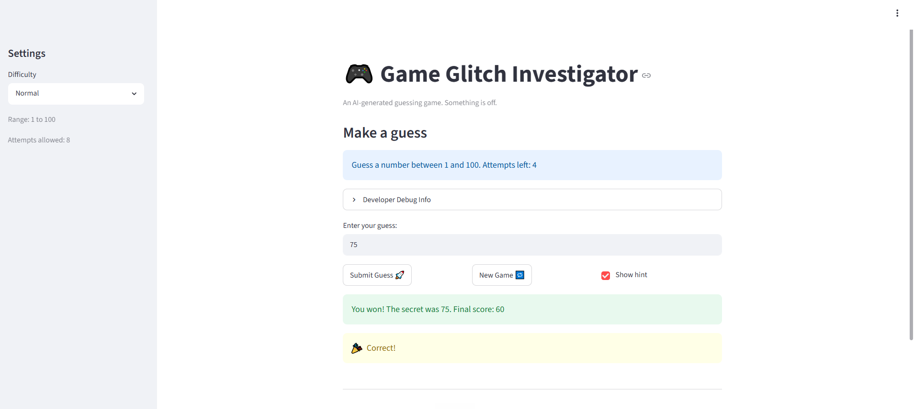

# 🎮 Game Glitch Investigator: The Impossible Guesser

## 🚨 The Situation

You asked an AI to build a simple "Number Guessing Game" using Streamlit.
It wrote the code, ran away, and now the game is unplayable. 

- You can't win.
- The hints lie to you.
- The secret number seems to have commitment issues.

## 🛠️ Setup

1. Install dependencies: `pip install -r requirements.txt`
2. Run the broken app: `python -m streamlit run app.py`

## 🕵️‍♂️ Your Mission

1. **Play the game.** Open the "Developer Debug Info" tab in the app to see the secret number. Try to win.
2. **Find the State Bug.** Why does the secret number change every time you click "Submit"? Ask ChatGPT: *"How do I keep a variable from resetting in Streamlit when I click a button?"*
3. **Fix the Logic.** The hints ("Higher/Lower") are wrong. Fix them.
4. **Refactor & Test.** - Move the logic into `logic_utils.py`.
   - Run `pytest` in your terminal.
   - Keep fixing until all tests pass!

## 📝 Document Your Experience

- [ ] Describe the game's purpose.
   - The major purpose of the game is to give hands on experience in  collaborating with AI to debug and refator AI gnenerated code 
- [ ] Detail which bugs you found.
  -- **Attempt counter starts one too low across all difficulty levels.** The game appears to count an attempt before the player makes a guess. For example, in Normal mode (8 attempts allowed), the game immediately shows only 7 attempts remaining at the start of a new game.

   - **Higher/lower hint logic is reversed.** When the player's guess is higher than the secret number, the game incorrectly instructs the player to guess higher instead of lower, and vice versa. For example, in Normal mode, entering `50` resulted in a "go higher" hint even though the correct answer was `9`.

   - **"Submit Guess" stops working after starting a new game.** Once a game ends and **New Game** is clicked, the **Submit Guess** button becomes unresponsive.

   - **Show Hint toggle does not restore existing hints.** Unchecking **Show Hint** correctly hides the hint, but rechecking it does not display the current hint again. The hint only reappears after submitting another guess while the option is enabled.

   - **Attempts value is incorrectly initialized in debug information.** Each time the page is loaded, the attempts field in the developer debug panel is set to `1` for all difficulty levels instead of starting at `0`.

   - **Instructions do not update based on difficulty.** The game always displays "Guess a number between 1 and 100" regardless of the selected difficulty, even though each difficulty level has a different valid range.

   - **Difficulty changes do not reset game state correctly.** Switching between difficulty levels does not generate a new secret number or update values to match the selected mode. For example, starting in Normal mode with a secret number of `96` and then switching to Hard or Easy mode leaves the secret number unchanged, even when it falls outside the valid range for those difficulties. The game still allows play with this invalid setup.

   - **Guess history in debug information does not reset or update correctly.** Clicking **New Game** does not clear the history list, and the list updates with a delay. Instead of showing the latest guess immediately, it displays guesses from one or two turns earlier.

   - **Score calculation may be incorrect.** Guessing the correct answer on the first attempt resulted in a score of `77`. If first-attempt success is intended to receive the maximum possible score (or a higher score than 77), the scoring formula may not be calculating points correctly. Theres also negative scores 
- [ ] Explain what fixes you applied.
   - Swapped the hint labels so "Too High" tells the player to go lower and "Too Low" tells them to go higher
   - Fixed the attempt counter initializing at 1 instead of 0 and moved the constant to logic_utils as INITIAL_ATTEMPTS
   - Fixed New Game not clearing status, history, or score, which caused Submit Guess to stop working in the next game
   - Fixed difficulty switches not resetting game state or picking a new secret within the correct range
   - Fixed the instructions always showing "1 to 100" regardless of difficulty — they now reflect the actual range
   - Fixed the Show Hint toggle so it re-displays the last hint when re-checked, without needing a new guess
   - Fixed the scoring formula's off-by-one on attempt_number and added a floor of 0 to prevent negative scores
   - Fixed a type mismatch bug where the secret was cast to a string on even attempts, causing wrong comparisons
   - Moved parse_guess and check_guess out of app.py into logic_utils.py so they can be unit tested independently
   - Wrote 39 unit tests covering check_guess, parse_guess, and an INITIAL_ATTEMPTS regression guard

## 📸 Demo Walkthrough

Describe your fixed game in numbered steps so a reader can follow along without watching a video:
1. User chooses difficulty level
2. User enters  a guess 
3. Game returns "📉 Go LOWER!"
4. User enters another guess
5. Game returns "📈 Go HIGHER!"
6. Score updates correctly after each guess
7. Game ends after the correct guess or user runs out of attempts

**Screenshot** *(optional)*: 
